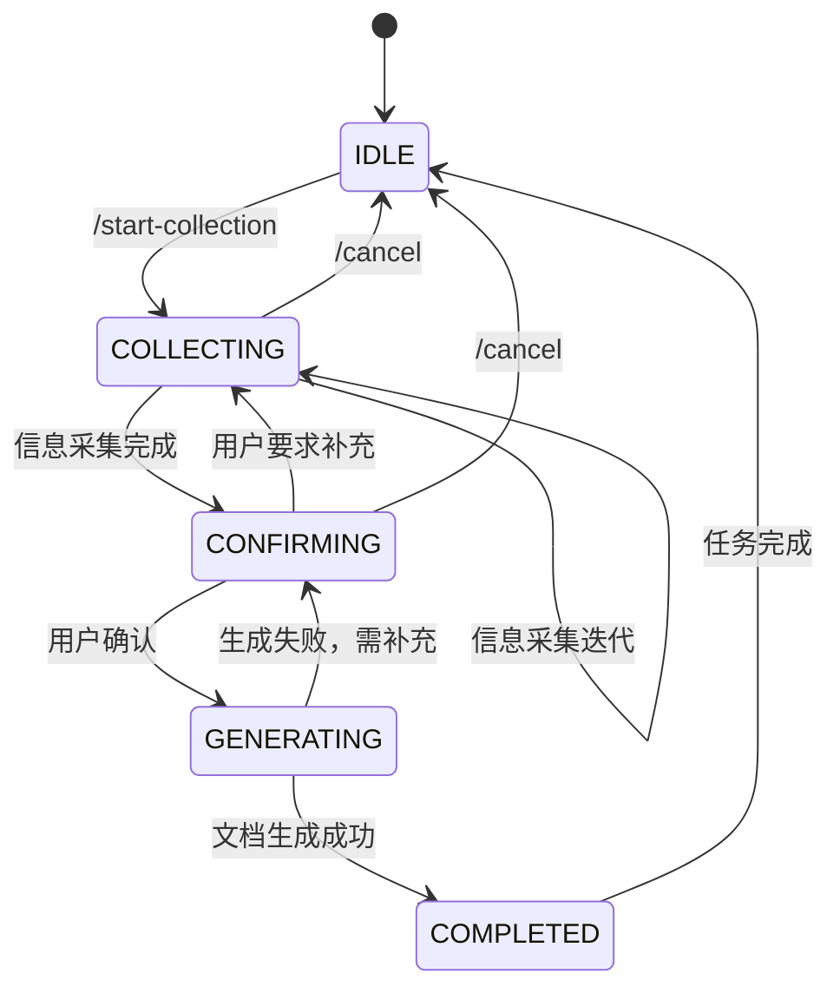

# 现场信息收集Agent（FieldInfoCollector）

## 一、AGENT定义

### 1.1 基本信息

```yaml
name: FieldInfoCollector
version: 1.0.0
description: 辅助现场供电服务人员进行信息收集，自动生成应用文档的智能Agent
category: field-service
type: assistant
```

### 1.2 核心定位

**角色定位**：现场工作人员的AI助手（Copilot）
**工作模式**：对话式协作，被动触发+主动引导
**核心价值**：让现场人员"开口说、随手拍"，Agent自动完成信息结构化、文档生成、知识入库

### 1.3 触发条件

**显式触发**（用户主动调用）：
- `/start-collection` - 开始信息采集任务
- `/collect-power-room` - 采集配电房信息
- `/collect-customer-visit` - 采集客户走访信息
- `/collect-emergency-access` - 采集应急接入信息
- `/collect-device-defect` - 采集设备缺陷信息
- `/generate-report` - 生成报告

**隐式触发**（上下文感知）：
- 检测到用户发送语音消息（自动转为信息录入）
- 检测到用户发送照片（自动分析并存档）
- 检测到位置信息（自动关联到小区/配电房）

### 1.4 状态管理

```yaml
session_states:
  - IDLE: 待机状态，等待指令
  - COLLECTING: 采集中，引导用户完成信息采集
  - CONFIRMING: 确认中，展示采集结果等待用户确认
  - GENERATING: 生成中，正在生成文档
  - COMPLETED: 完成，已更新知识库

context_memory:
  - current_task: 当前采集任务类型
  - current_community: 当前小区
  - collected_data: 已采集的数据（临时存储）
  - pending_questions: 待确认的问题清单
```

---

## 二、SKILLS（技能定义）

### Skill 1: 语音信息采集（VoiceInfoCapture）

```yaml
skill_id: voice_info_capture
name: 语音信息采集
description: 将语音输入转为结构化信息
triggers:
  - voice_message_received
  - command: "/voice-input"

parameters:
  - audio_data: 语音数据（base64或URL）
  - context: 当前采集上下文（可选）

workflow:
  1. 调用语音识别工具（STT）
  2. 使用NLP提取关键信息（实体识别）
  3. 根据上下文填充到对应字段
  4. 返回结构化数据+确认请求

output:
  - transcribed_text: 转录文本
  - extracted_entities: 提取的实体（位置、设备、时间等）
  - filled_form: 填充的表单字段
  - confidence: 置信度
```

### Skill 2: 图像信息采集（ImageInfoCapture）

```yaml
skill_id: image_info_capture
name: 图像信息采集
description: 分析现场照片，提取关键信息并自动标注
triggers:
  - image_received
  - command: "/photo-capture"

parameters:
  - image_data: 图像数据
  - capture_type: 拍摄类型（铭牌/设备/缺陷/全景）
  - location: GPS坐标（可选）

workflow:
  1. 图像质量检查（清晰度、亮度）
  2. 根据capture_type调用对应OCR/识别工具
  3. 提取关键信息（型号、编号、参数）
  4. 自动打标签分类
  5. 关联到当前采集任务

output:
  - image_id: 图像唯一ID
  - ocr_results: OCR识别结果
  - extracted_info: 提取的关键信息
  - labels: 自动标签（设备类型/隐患类型等）
  - storage_path: 存储路径
```

### Skill 3: 表单智能填充（SmartFormFill）

```yaml
skill_id: smart_form_fill
name: 表单智能填充
description: 根据多模态输入自动填充标准化表单
triggers:
  - data_piece_collected
  - command: "/fill-form"

parameters:
  - form_type: 表单类型
  - input_data: 多模态输入数据（语音/图像/文本）
  - existing_data: 已有数据（增量更新）

supported_forms:
  - power_room_info: 配电房信息表
  - emergency_access: 应急接入信息表
  - customer_visit: 客户走访记录表
  - device_defect: 设备缺陷记录表
  - work_summary: 工作总结表

workflow:
  1. 根据form_type加载表单模板
  2. 解析input_data，映射到表单字段
  3. 调用知识库查询关联信息（自动填充已知信息）
  4. 识别缺失字段，生成补充问题
  5. 返回填充后的表单+待补充清单

output:
  - form_data: 填充后的表单数据（JSON）
  - missing_fields: 缺失字段清单
  - suggestions: 智能建议（如"建议拍摄变压器铭牌"）
  - completeness: 完整度评分
```

### Skill 4: 文档自动生成（DocumentGeneration）

```yaml
skill_id: document_generation
name: 文档自动生成
description: 基于采集的数据自动生成标准化文档
triggers:
  - collection_completed
  - command: "/generate-report"

parameters:
  - template_type: 文档模板类型
  - data_source: 数据来源（本次采集/历史数据/组合）
  - output_format: 输出格式（Word/PDF/Markdown）

workflow:
  1. 加载文档模板
  2. 从data_source提取数据
  3. 数据格式化和校验
  4. 填充模板生成文档
  5. 质量检查（完整性、一致性）

output:
  - document_id: 文档ID
  - document_content: 文档内容（或存储路径）
  - document_url: 文档下载链接
  - metadata: 文档元数据（创建时间、作者、关联任务等）
```

### Skill 5: 知识库自动更新（KnowledgeBaseSync）

```yaml
skill_id: knowledge_base_sync
name: 知识库自动更新
description: 将采集信息同步到企业知识库
triggers:
  - document_confirmed
  - command: "/sync-to-kb"

parameters:
  - data_batch: 待同步的数据批次
  - target_systems: 目标系统列表

workflow:
  1. 数据标准化处理
  2. 建立实体关联（小区-设备-客户）
  3. 更新知识图谱
  4. 同步到业务系统（台账系统、CRM等）
  5. 生成更新报告

output:
  - sync_report: 同步报告（成功/失败详情）
  - updated_records: 更新的记录清单
  - conflicts: 冲突记录（如有）
```

### Skill 6: 智能引导对话（SmartGuidance）

```yaml
skill_id: smart_guidance
name: 智能引导对话
description: 主动引导用户完成信息采集，确保完整性和准确性
triggers:
  - collection_started
  - field_missing
  - low_confidence_detected

parameters:
  - current_progress: 当前进度
  - missing_items: 缺失项清单
  - user_context: 用户上下文（角色、经验等）

workflow:
  1. 分析当前进度和缺失项
  2. 生成引导性问题（按优先级排序）
  3. 根据用户回答动态调整引导策略
  4. 提供示例和提示
  5. 实时反馈采集质量

output:
  - guidance_message: 引导消息（自然语言）
  - next_action: 建议的下一步操作
  - progress_indicator: 进度指示（如"已完成70%"）
```

---

## 三、TOOLS（工具调用）

### Tool 1: 语音识别（SpeechToText）

```yaml
tool_id: baidu_stt
type: external_api
provider: baidu
endpoint: https://vop.baidu.com/server_api

parameters:
  - audio: 语音文件（base64）
  - format: 音频格式（pcm/wav/amr）
  - rate: 采样率（16000）
  - dev_pid: 语言模型（1537=普通话）

features:
  - 支持四川方言（dev_pid=1837）
  - 支持领域定制（电力专业术语）
  - 实时流式识别（可选）

response:
  - result: 识别文本列表
  - err_no: 错误码
  - err_msg: 错误信息
```

### Tool 2: 图像OCR识别（ImageOCR）

```yaml
tool_id: paddle_ocr
type: local_service / external_api
provider: PaddleOCR

parameters:
  - image: 图像文件
  - ocr_type: 识别类型
    - general: 通用文字识别
    - table: 表格识别
    - structure: 结构化识别（铭牌、发票等）

features:
  - 中文识别优化
  - 支持多语言混合
  - 支持旋转、倾斜文本
  - 结构化输出（键值对提取）

response:
  - text_results: 识别文本列表（含坐标）
  - structured_data: 结构化数据（如型号=XXX，容量=YYY）
```

### Tool 3: 自然语言理解（NLU）

```yaml
tool_id: llm_nlu
type: llm
provider: openai / baidu / local
model: gpt-3.5-turbo / 文心一言

parameters:
  - text: 输入文本
  - task: 任务类型
    - entity_extraction: 实体提取
    - intent_classification: 意图分类
    - information_extraction: 信息抽取
    - summarization: 摘要生成
  - schema: 提取模式（实体类型定义）

features:
  - 电力领域实体识别（设备、位置、参数）
  - 多轮对话上下文理解
  - 信息不完整检测

response:
  - entities: 实体列表
  - intent: 意图分类
  - extracted_info: 抽取的信息（JSON格式）
  - confidence: 置信度
```

### Tool 4: 知识库查询（KnowledgeQuery）

```yaml
tool_id: kb_query
type: database
connection: postgresql:///

operations:
  - query_community_info:
      description: 查询小区基本信息
      parameters:
        - community_id: 小区ID
        - fields: 查询字段列表
  
  - query_customer_history:
      description: 查询客户历史记录
      parameters:
        - customer_id: 客户ID
        - record_types: 记录类型（投诉/走访/停电）
  
  - query_device_info:
      description: 查询设备信息
      parameters:
        - device_id: 设备ID
        - device_type: 设备类型

  - update_record:
      description: 更新记录
      parameters:
        - table: 表名
        - record_id: 记录ID
        - data: 更新数据

response:
  - data: 查询结果
  - success: 操作是否成功
  - error: 错误信息（如有）
```

### Tool 5: 文档存储（DocumentStorage）

```yaml
tool_id: doc_storage
type: storage_service
provider: minio / aliyun_oss / local

operations:
  - upload:
      parameters:
        - file: 文件数据
        - path: 存储路径
        - metadata: 元数据
  
  - download:
      parameters:
        - file_id: 文件ID
  
  - generate_url:
      parameters:
        - file_id: 文件ID
        - expire: 过期时间

response:
  - file_id: 文件唯一ID
  - url: 访问URL
  - size: 文件大小
```

### Tool 6: 模板引擎（TemplateEngine）

```yaml
tool_id: docx_template
type: library
library: python-docx-template

operations:
  - render_template:
      parameters:
        - template_path: 模板文件路径
        - data: 填充数据（JSON）
        - output_path: 输出路径
  
  - generate_pdf:
      parameters:
        - docx_path: Word文档路径
        - output_path: PDF输出路径

features:
  - 支持Word模板（.docx）
  - 支持条件渲染（如"如有隐患则显示"）
  - 支持循环渲染（如"遍历所有设备"）
  - 自动格式调整

response:
  - output_path: 生成文件路径
  - success: 是否成功
```

---

## 四、工作流编排

### 4.1 典型工作流：配电房信息采集

```mermaid
graph TD
    A[用户: /collect-power-room 小区ID] --> B[Agent: 加载采集模板]
    B --> C[Agent: 查询小区基本信息]
    C --> D[Agent: 发送引导消息<br/>"现在开始采集XX小区配电房信息"]
    
    D --> E[用户: 语音描述位置]
    E --> F[Skill: voice_info_capture<br/>语音转文字+提取位置]
    F --> G[Agent: 确认位置信息<br/>发送确认消息]
    
    G --> H[用户: 拍摄变压器铭牌]
    H --> I[Skill: image_info_capture<br/>OCR识别铭牌信息]
    I --> J[Skill: smart_form_fill<br/>自动填充设备信息]
    J --> K[Agent: 展示识别结果<br/>询问是否准确]
    
    K -->|确认| L[继续下一步采集]
    K -->|修正| M[用户补充或修正]
    M --> L
    
    L --> N[循环采集其他信息...]
    N --> O[所有必要信息采集完成]
    
    O --> P[Skill: document_generation<br/>生成配电房信息表]
    P --> Q[Agent: 展示生成的文档预览]
    
    Q --> R[用户: 确认或补充]
    R -->|确认| S[Skill: knowledge_base_sync<br/>更新知识库]
    R -->|补充| T[继续补充采集]
    T --> P
    
    S --> U[Agent: 任务完成<br/>发送总结报告]
```

### 4.2 状态流转图



---

## 五、输入输出规范

### 5.1 输入格式

**命令消息**（用户主动触发）：
```json
{
  "type": "command",
  "command": "/collect-power-room",
  "parameters": {
    "community_id": "COMM_001",
    "community_name": "阳光小区"
  },
  "user_id": "USER_001",
  "timestamp": "2026-03-17T10:00:00Z"
}
```

**语音消息**（自动触发采集）：
```json
{
  "type": "voice",
  "audio_url": "https://.../voice_001.amr",
  "duration": 15,
  "context": {
    "current_task": "power_room_collection",
    "current_community": "阳光小区"
  }
}
```

**图像消息**（自动触发分析）：
```json
{
  "type": "image",
  "image_url": "https://.../photo_001.jpg",
  "location": {
    "latitude": 30.123,
    "longitude": 104.456
  }
}
```

### 5.2 输出格式

**引导消息**（Agent主动发送）：
```json
{
  "type": "guidance",
  "message": "配电房位置已记录：3号楼地下室。\n\n下一步：请拍摄变压器铭牌照片，以便自动识别设备信息。",
  "progress": {
    "current": 2,
    "total": 8,
    "percentage": 25
  },
  "suggestions": [
    "建议拍摄清晰的铭牌照片",
    "如有多台变压器，请分别拍摄"
  ],
  "next_actions": [
    {
      "type": "photo_capture",
      "description": "拍摄铭牌"
    },
    {
      "type": "voice_input",
      "description": "语音补充"
    }
  ]
}
```

**表单预览**（采集过程中展示）：
```json
{
  "type": "form_preview",
  "form_type": "power_room_info",
  "form_data": {
    "community_name": "阳光小区",
    "location": "3号楼地下室",
    "transformer_count": 2,
    "transformer_info": [
      {
        "model": "SCB11-500/10",
        "capacity": "500kVA",
        "manufacturer": "某某电气"
      }
    ]
  },
  "completeness": 65,
  "missing_fields": ["投运时间", "开关柜型号"],
  "can_generate": false
}
```

**完成报告**（任务结束时）：
```json
{
  "type": "completion_report",
  "task_id": "TASK_001",
  "summary": {
    "community": "阳光小区",
    "collection_type": "power_room",
    "duration": 25,
    "items_collected": 12
  },
  "documents": [
    {
      "type": "power_room_info",
      "url": "https://.../doc_001.docx",
      "size": "156KB"
    }
  ],
  "kb_updates": {
    "community_record": "updated",
    "device_records": 3,
    "photos": 5
  },
  "next_steps": [
    "已同步到知识库",
    "可在系统查看完整报告"
  ]
}
```

---

## 六、知识库集成

### 6.1 实体关系模型

```yaml
entities:
  Community:
    - id: 小区ID
    - name: 小区名称
    - address: 地址
    - power_room_count: 配电房数量
    - customer_count: 客户数量
    
  PowerRoom:
    - id: 配电房ID
    - community_id: 所属小区
    - location: 位置
    - photos: 照片列表
    - devices: 设备清单
    
  Transformer:
    - id: 设备ID
    - power_room_id: 所在配电房
    - model: 型号
    - capacity: 容量
    - manufacturer: 制造商
    - install_date: 投运时间
    
  Customer:
    - id: 客户ID
    - community_id: 所属小区
    - name: 姓名
    - address: 地址
    - phone: 电话
    - is_sensitive: 是否敏感客户
    - outage_history: 停电历史
    
  VisitRecord:
    - id: 记录ID
    - customer_id: 客户ID
    - visit_time: 走访时间
    - content: 走访内容
    - issues: 问题清单
    - satisfaction: 满意度
    
  Defect:
    - id: 缺陷ID
    - device_id: 设备ID
    - type: 缺陷类型
    - level: 缺陷等级
    - description: 描述
    - photos: 照片
    - status: 状态

relationships:
  - Community HAS_MANY PowerRooms
  - PowerRoom HAS_MANY Transformers
  - Community HAS_MANY Customers
  - Customer HAS_MANY VisitRecords
  - Transformer HAS_MANY Defects
```

### 6.2 自动更新规则

**规则1：配电房信息更新**
- 触发条件：配电房信息采集完成
- 操作：
  - 更新Community.power_room_info
  - 创建/更新PowerRoom记录
  - 创建/更新Transformer记录
  - 关联照片到对应设备

**规则2：客户走访记录**
- 触发条件：客户走访信息采集完成
- 操作：
  - 创建VisitRecord
  - 更新Customer.last_visit_time
  - 如有投诉，创建Issue记录

**规则3：设备缺陷记录**
- 触发条件：缺陷信息采集完成
- 操作：
  - 创建Defect记录
  - 关联到对应设备
  - 如为紧急缺陷，发送告警通知

---

## 七、安全与权限

### 7.1 数据安全

- **传输加密**：所有API调用使用HTTPS
- **存储加密**：敏感数据（客户电话）加密存储
- **访问控制**：基于角色的权限管理
- **审计日志**：记录所有数据操作

### 7.2 权限控制

```yaml
roles:
  field_worker:
    - can_collect_info
    - can_generate_report
    - can_view_own_records
    
  supervisor:
    - can_view_all_records
    - can_verify_report
    - can_export_data
    
  admin:
    - can_manage_templates
    - can_configure_system
    - can_access_analytics
```

---

## 八、部署配置

### 8.1 配置示例

```yaml
# config.yaml
agent:
  name: FieldInfoCollector
  version: 1.0.0
  
skills:
  voice_info_capture:
    enabled: true
    stt_provider: baidu
    
  image_info_capture:
    enabled: true
    ocr_provider: paddle
    
  document_generation:
    enabled: true
    template_dir: ./templates
    default_format: docx

tools:
  baidu_stt:
    api_key: ${BAIDU_API_KEY}
    secret_key: ${BAIDU_SECRET_KEY}
    
  kb_query:
    db_connection: ${DB_CONNECTION_STRING}
    
  doc_storage:
    provider: minio
    endpoint: ${MINIO_ENDPOINT}
    bucket: field-info-docs

knowledge_base:
  auto_sync: true
  sync_on_complete: true
  conflict_resolution: manual_review
```

---

## 九、扩展能力

### 9.1 未来扩展方向

1. **AI预测能力**
   - 基于历史数据预测设备故障风险
   - 预测客户投诉概率

2. **智能调度**
   - 根据采集数据优化驻点路线
   - 推荐下次驻点时间

3. **协作功能**
   - 多人同时采集自动合并
   - 专家远程协助（视频通话+屏幕标注）

4. **AR辅助**
   - AR眼镜显示设备信息
   - 虚拟标注指导操作

---

**总结**：这是一个完整的OpenClaw Agent设计，包含明确的SKILLS（6个核心技能）、TOOLS（6个外部工具）、工作流编排、输入输出规范。可以直接基于此设计进行开发实现。
